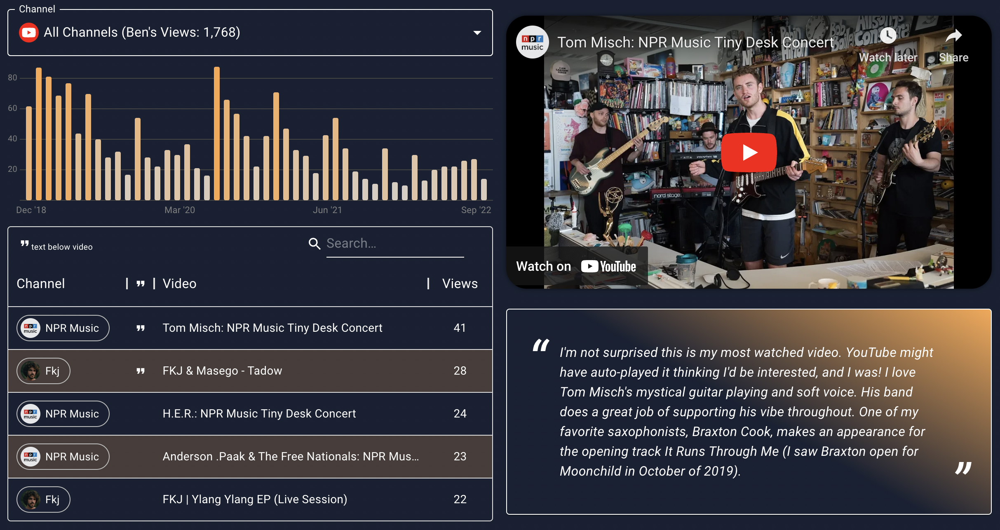

# What's in My YouTube History: Music

This app was created mostly to learn React.js and the MUI components. I used Create React App for initialization and several modules for development. Here are some notes!

## Inspiration

I saw a Reddit post on [r/dataisbeautiful](https://reddit.com/r/dataisbeautiful) where someone looked into their YouTube history data. As someone who is chronically online, I was immediately interested in this data so after downloading from Google Takeout I explored in R! Soon after the idea to filter to music came about.

## Modules Used (Highlights)

- [tidyjs](https://pbeshai.github.io/tidy/): data manipulation, follows tidyverse format from R <3
- [mui/material](https://mui.com/material-ui/getting-started/overview/): this Material UI library is awesome. There are so many components available and customization is super solid. I got deep into the docs for some of the styling in this app and learned a lot along the way!
- [mui/x-data-grid](https://mui.com/x/introduction/): very customizable table! works well with mui/material
- [visx](https://airbnb.io/visx/): d3 viz components from Airbnb (still leaves d3 modularity on the table, Observable Plot did not)
- [d3](https://d3js.org/): mainly for formatting functions, visx did most of the plotting work
- [swiper](https://swiperjs.com/): cool swiping interaction for the channel list

## Future Considerations

- automated testing of components using jest as I go
- CSS Postprocessing, less inline styling, style at the start
- more folders for components
- task management (Trello?)
- aria labels for a11y
- less "design as I develop" and more work in Figma upfront. I just sort of dove into developing (which was great for learning unwieldy at the end)
- consider overall package size and how I can reduce
- arquero instead of tidyjs

## Product Ideas

- connect to an API around what the most popular YouTube videos are [like this site, kworb.net](https://kworb.net/youtube/)
- ability to import your own Google Takeout data and generate a similar view
- a visualization with floating bubbles (d3-force) to provide a UI to explore popular videos
